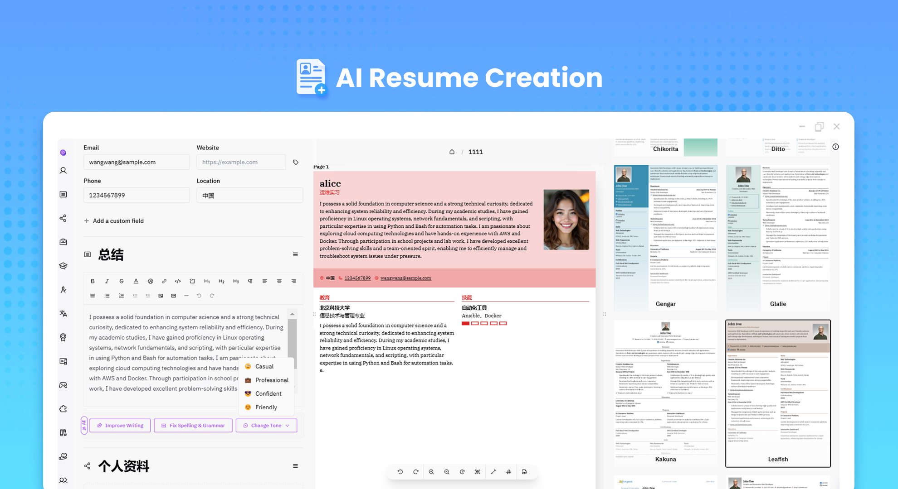
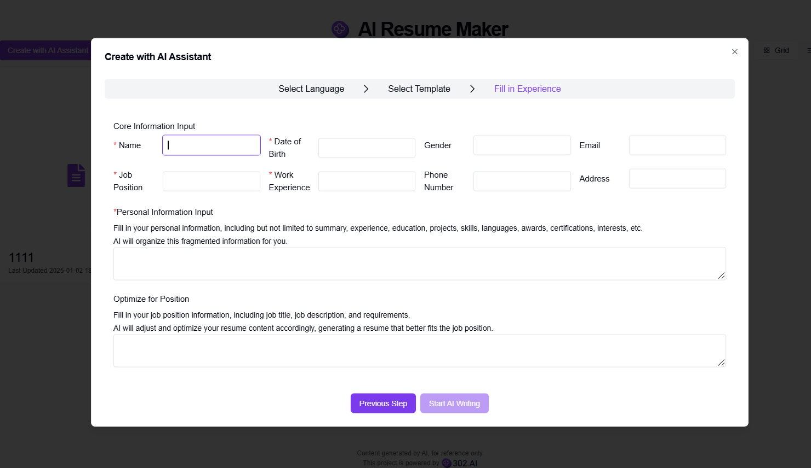
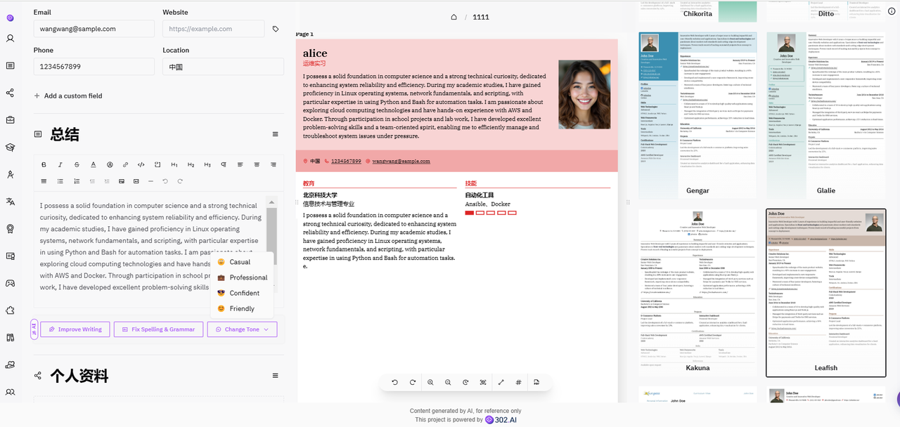
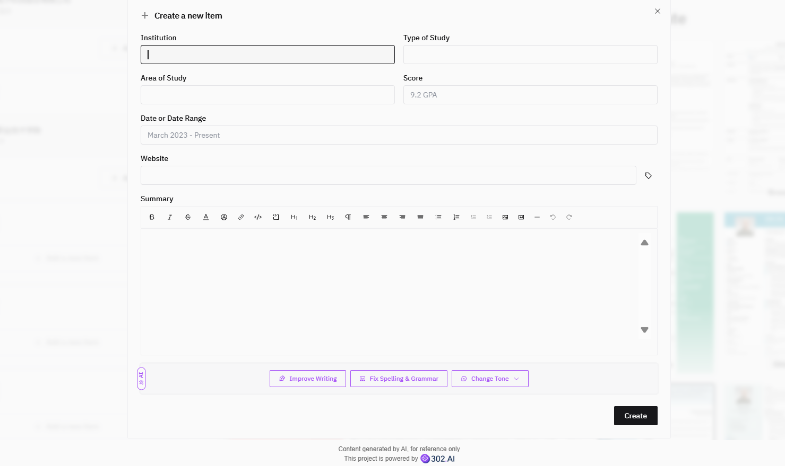

# 
📝 AI Resume Creation 🚀✨

AI resume creation polishes the personal information filled in by users through AI. It can not only translate into multiple languages, but also adjust and optimize according to the information of the job application position to generate high-quality resumes.

<a href="README_zh.md">中文</a> | <a href="README.md">English</a> | <a href="README_ja.md">日本語</a>

This is the open-source version of [AI Resume Creation](https://302.ai/en/tools/resume/) from [302.AI](https://302.ai).
You can log in directly to 302.AI to use the online version with zero code and zero configuration.
Alternatively, you can modify this project according to your needs, input 302.AI's API KEY, and deploy it yourself.

## Interface Preview
You can use AI to guide the creation of a resume, fill in basic job information and personal experience information, select a template, and directly enter resume writing. On this page, you can also choose to have AI assist in optimizing resume content for the position.
      

Select a resume template, enter relevant information, and you can see the preview effect of the resume in the middle and continuously modify it. You can also use AI to polish the description.
        

You can freely add new entries to continuously enrich your resume content.

## Project Features

### 📝 Core Functions

- Resume Templates: Provides dozens of professional templates for selection
- Drag and Drop Customization: Supports free drag-and-drop layout for the resume
- Real-Time Editing: Edit in real-time, see what you get
- Privacy Protection: Zero user tracking, no ad interference
- Multiple Export Formats: Supports PDF, JSON, and other formats
- Dark Mode: Supports dark theme, provides a comfortable editing experience

### 🤖 AI-Enhanced Functions

- AI Polishing: Polishes the user's personal information through AI, generating high-quality resumes
- AI Multi-Language Translation: Supports multi-language translation
- AI Job Optimization: Optimizes and generates high-quality resumes according to job information

### 🎨 Custom Styles

- Rich Theme Colors: Customize the overall tone of the resume
- Flexible Layout: Supports custom page margins and paragraph spacing
- Font Selection: Supports multiple professional fonts
- Custom Paragraphs: Adjust the display order and style of each part
- Photo Settings: Supports adding and adjusting personal photos
- Custom Header and Footer: Customize page elements

### 🌍 Multi-language Support

- Chinese interface
- English interface
- Japanese interface
- And many other international languages

Through the AI Resume Creation project, we can quickly create professional-level resumes, AI not only assists in editing but also stimulates creativity, providing new ideas and inspiration for resumes.🎉💻 Let's explore the new world of AI-driven resumes together! 🌟🚀

## 🚩 Future Update Plan

- [ ] Optimize job optimization
- [ ] Optimize AI polishing

## Tech Stack

- react
- Reactive-Resume

## Development & Deployment

1. Clone the project `git clone https://github.com/302ai/302_resume`
2. Install dependencies `yarn install`
3. Configure 302's API KEY (refer to .env.example)
4. Run the project `yarn run dev`
5. Build and deploy `docker build -t resume . && docker run -p 3000:3000 resume`

## ✨ About 302.AI ✨

[302.AI](https://302.ai) is an AI application platform for enterprises, with pay-as-you-go pricing, ready to use out of the box, and an open-source ecosystem. ✨

1. 🧠 Combines the latest and most comprehensive AI capabilities and brands, including but not limited to language models, image models, voice models, and video models.
2. 🚀 Conducts deep application development on basic models, developing real AI products rather than simple chatbots.
3. 💰 Zero monthly fees, all functions are pay-per-use, fully open, achieving truly low barriers and high ceilings.
4. 🛠 Powerful management backend, aimed at teams and SMEs, managed by one person, used by many.
5. 🔗 All AI capabilities provide API access, and all tools are open-source and customizable (in progress).
6. 💡 Strong development team, launching 2-3 new applications every week, with daily product updates. Developers interested in joining are welcome to contact us.
