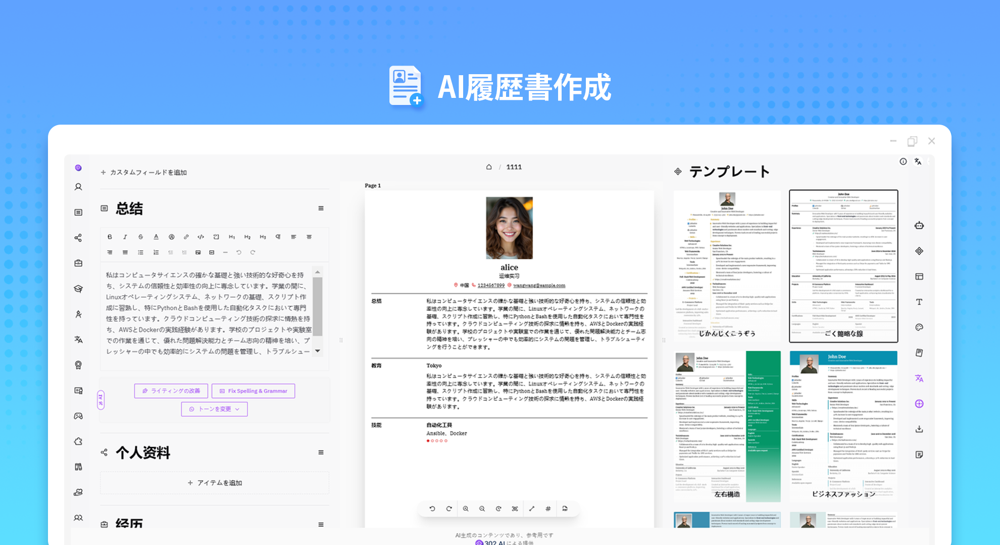
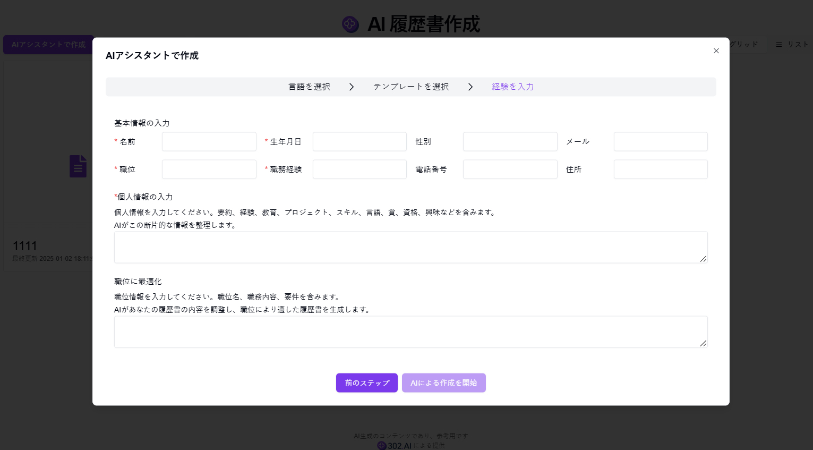
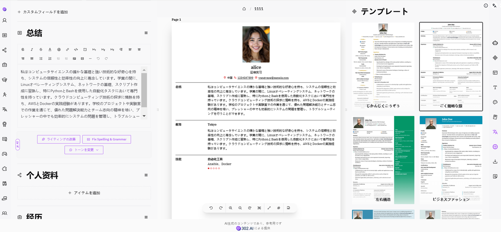
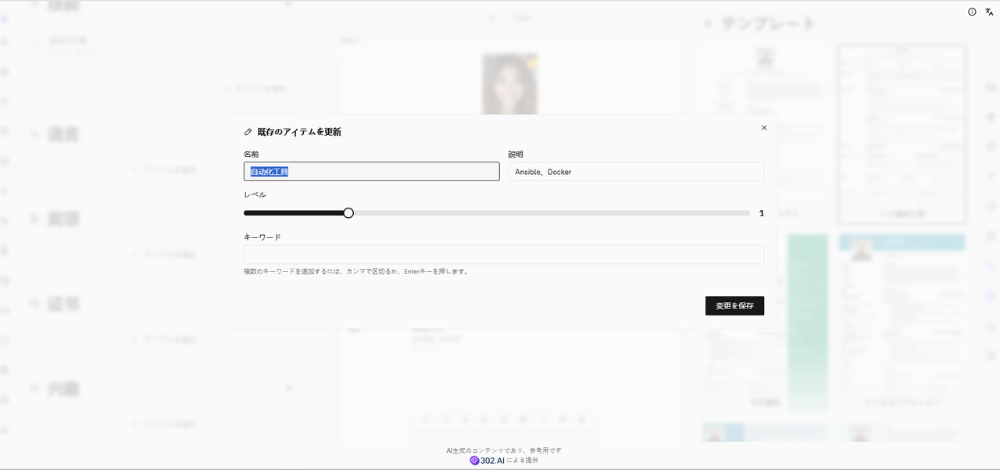

# 
📝 AI 履歴書作成 🚀✨

AI 履歴書作成は、AI を使ってユーザーが入力した個人情報を磨きます。複数言語の翻訳が可能なだけでなく、求職ポジションの情報に基づいて調整と最適化を行い、高品質の履歴書を生成することができます。

<a href="README_zh.md">中文</a> | <a href="README.md">English</a> | <a href="README_ja.md">日本語</a>

[302.AI](https://302.ai/ja/)の[AI履歴書作成](https://302.ai/ja/tools/resume/)のオープンソースバージョン。
302.AIに直接ログインして、コードやコンフィグレーション不要でオンラインバージョンを使用できます。
または、このプロジェクトを自分のニーズに合わせて変更し、302.AIのAPIキーを使用して独自にデプロイすることができます。

## インターフェースプレビュー
AIガイドを使用して履歴書を作成し、基本的な求職情報と個人経歴情報を記入し、テンプレートを選択してから履歴書の作成に直接アクセスすることができ、このページではAIに職場に対して履歴書の内容を最適化するために協力してもらうこともできます。
     

履歴書テンプレートを選択し、関連情報を入力すると、履歴書のプレビュー効果を中央に見て修正し、AIで説明を潤色することができます。
    

新しいエントリを自由に追加でき、履歴書の内容を常に豊富にすることができます。

## プロジェクトの特徴

### 📝 コア機能

- 履歴書テンプレート：数十種類の専門テンプレートを提供
- ドラッグ＆ドロップカスタマイズ：履歴書のレイアウトを自由に変更
- リアルタイム編集：見たままの編集体験
- プライバシー保護：ユーザーの追跡なし、広告の干渉なし
- 複数形式のエクスポート：PDF、JSONなど、複数の形式でエクスポート
- ダークモード：ダークテーマのサポート、快適な編集体験

### 🤖 AI強化機能

- AIの磨き上げ：ユーザーが入力した個人情報に基づいて、AIの磨き上げで、高品質の履歴書を生成
- AIによる多言語翻訳：多言語翻訳をサポート
- AIによる職務最適化：求職ポジションの情報に基づいて調整と最適化を行い、高品質の履歴書を生成

### 🎨 カスタムスタイル

- 豊富なテーマカラー：簡歴全体の色調を自定义可能
- フレキシブルなページレイアウト：ページの余白と段落間の余白を自定义可能
- フォント選択：多くのプロフェッショナルなフォントをサポート
- セクションのカスタマイズ：各セクションの表示順序とスタイルを調整可能
- 写真設定：個人写真の追加と調整をサポート
- ヘッダーフッターのカスタマイズ：ページの要素を個性化して設定可能

### 🌍 多言語サポート

- 中国語インターフェース
- 英語インターフェース
- 日本語インターフェース
- など多くの国際言語

AI履歴書プロジェクトを通じて、私たちは迅速に専門級の履歴書を作成することができて、AIは編集を補助するだけでなく、アイデアを引き出して、履歴書に新しい構想とインスピレーションを提供することができます。🎉💻 AIが動かす履歴書の新しい世界を探ってみよう！ 🌟🚀

## 🚩 今後のアップデート計画

- [ ] 岗位最適化の最適化
- [ ] AI磨き上げの最適化

## 技術スタック

- react
- Reactive-Resume

## 開発とデプロイ

1. プロジェクトをクローン `git clone https://github.com/302ai/302_resume`
2. 依存関係をインストール `yarn install`
3. 302のAPIキーを設定（参照：.env.example）
4. プロジェクトを実行 `yarn run dev`
5. ビルドとデプロイ `docker build -t resume . && docker run -p 3000:3000 resume`

## ✨ 302.AIの紹介 ✨

[302.AI](https://302.ai/ja)は、企業向けのAIアプリケーションプラットフォームで、従量課金制、すぐに使える、オープンソースのエコシステムです。✨

1. 🧠 最新かつ最も包括的なAI機能とブランドを集結し、言語モデル、画像モデル、音声モデル、ビデオモデルなどを含みますが、これらに限定されません。
2. 🚀 基本モデルの上に深層アプリケーション開発を行い、単なる対話ボットではなく、真のAI製品を開発しています。
3. 💰 月額料金なし、すべての機能は従量課金制、完全にオープンで、真の意味で敷居が低く、上限が高いものを実現しています。
4. 🛠 強力な管理バックエンド、チームと中小企業向け、1人で管理し、多人数で使用可能。
5. 🔗 すべてのAI機能にAPIアクセスを提供し、すべてのツールはオープンソースでカスタマイズ可能（進行中）。
6. 💡 強力な開発チームが毎週2-3の新しいアプリをリリースし、製品は毎日更新されています。興味のある開発者の参加も歓迎します。お気軽にお問い合わせください。
