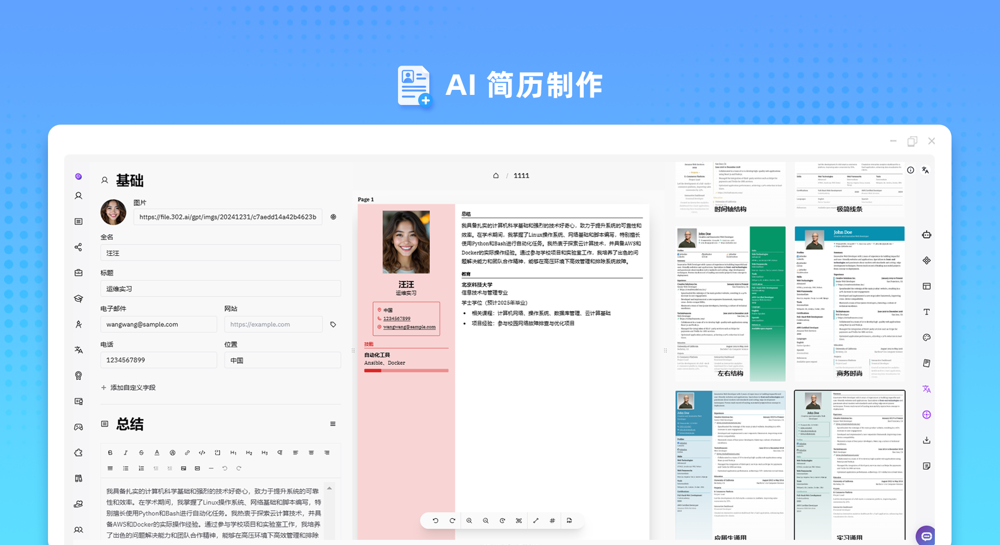
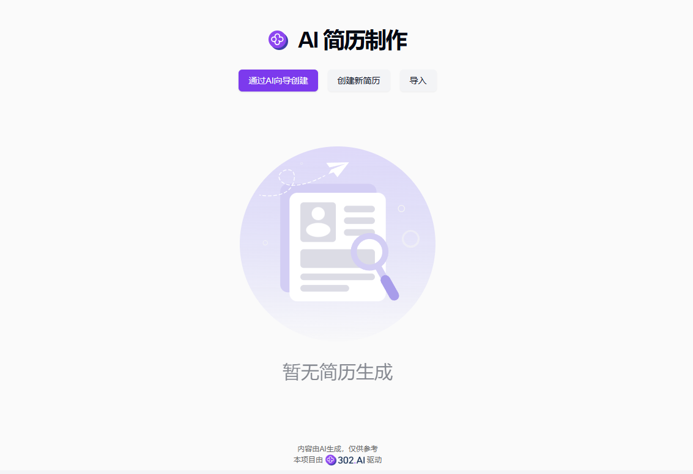
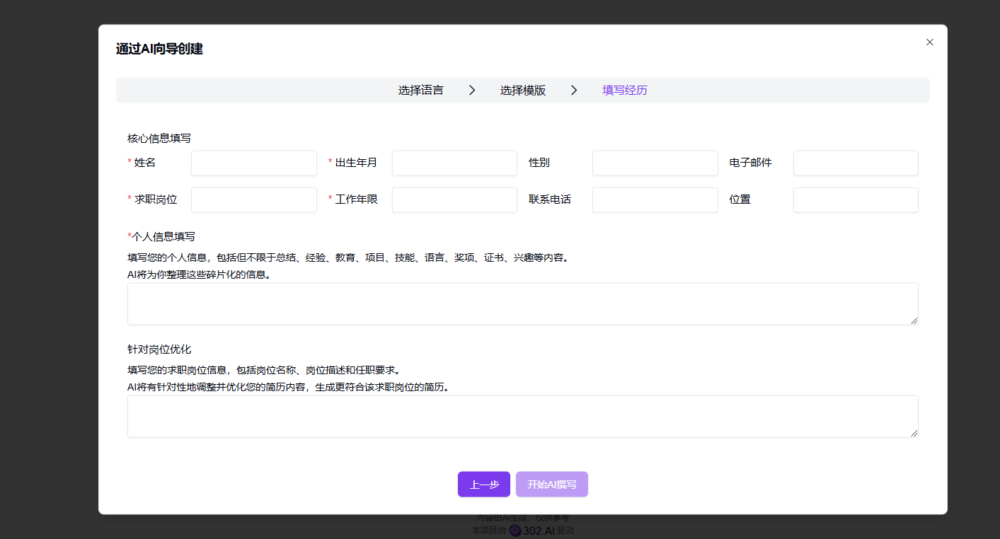
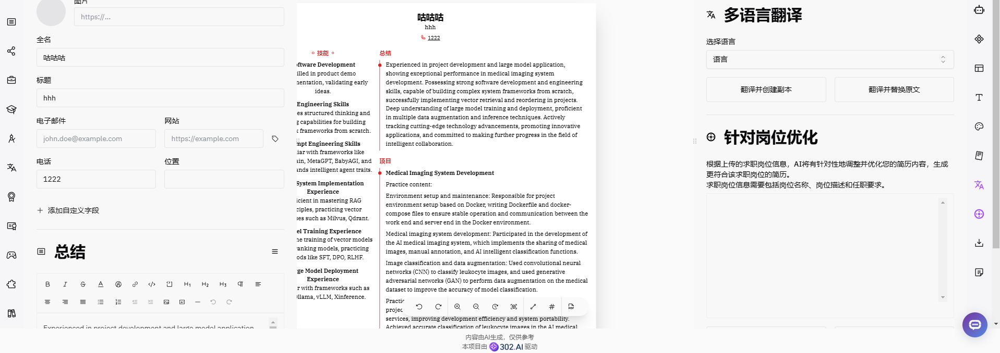

# 
📝 AI 简历制作 🚀✨

AI 简历制作通过AI润色用户填写的个人信息，不仅可以翻译多语言，还可以根据求职岗位的信息进行调整和优化，生成高质量的简历。

<a href="README_zh.md">中文</a> | <a href="README.md">English</a> | <a href="README_ja.md">日本語</a>

来自[302.AI](https://302.ai)的[ AI 个人简历 ](https://302.ai/tools/resume/)的开源版本。
你可以直接登录302.AI，零代码零配置使用在线版本。
或者对本项目根据自己的需求进行修改，传入302.AI的API KEY，自行部署。

## 界面预览

### 基于<a href="https://github.com/AmruthPillai/Reactive-Resume">Reactive-Resume</a>为主，通过AI润色用户填写的个人信息，不仅可以翻译多语言，还可以根据求职岗位的信息进行调整和优化，生成高质量的简历

## 项目特性

### 📝 Reactive-Resume核心功能

- 简历模板：提供数十种专业模板供选择
- 拖拽定制：支持简历版面的自由拖拽排版
- 实时编辑：所见即所得的编辑体验
- 隐私保护：零用户追踪，无广告干扰
- 多格式导出：支持 PDF、JSON 等多种格式导出
- 深色模式：支持暗色主题，提供舒适的编辑体验

### 🤖 AI增强功能

- AI润色：根据用户填写的个人信息，通过AI润色，生成高质量的简历
- AI多语言翻译：支持多语言翻译
- AI岗位优化：根据求职岗位的信息进行调整和优化，生成高质量的简历

### 🎨 自定义样式

- 丰富的主题配色：可自定义简历整体色调
- 灵活的版面布局：支持自定义页边距和段落间距
- 字体选择：支持多种专业字体
- 自定义段落：可调整各部分的显示顺序和样式
- 照片设置：支持添加和调整个人照片
- 自定义页眉页脚：可个性化设置页面元素

### 🌍 多语言支持

- 中文界面
- English Interface
- 日本語インターフェース
- 等多种国际语言

通过AI个人简历项目，我们能快速创建专业级的简历，AI不仅辅助编辑，还能激发创意，为简历提供新的思路和灵感。🎉💻 让我们一起探索AI驱动的简历新世界吧! 🌟🚀

## 🚩 未来更新计划

- [ ] 优化岗位优化
- [ ] 优化AI润色

## 技术栈

- react
- Reactive-Resume

## 开发&部署

1. 克隆项目 `git clone https://github.com/302ai/302_resume`
2. 安装依赖 `yarn install`
3. 配置302的API KEY 参考.env.example
4. 运行项目 `yarn run dev`
5. 打包部署 `docker build -t resume . && docker run -p 3000:3000 resume`

## ✨ 302.AI介绍 ✨

[302.AI](https://302.ai)是一个面向企业的AI应用平台，按需付费，开箱即用，开源生态。✨

1. 🧠 集合了最新最全的AI能力和品牌，包括但不限于语言模型、图像模型、声音模型、视频模型。
2. 🚀 在基础模型上进行深度应用开发，我们开发真正的AI产品，而不是简单的对话机器人
3. 💰 零月费，所有功能按需付费，全面开放，做到真正的门槛低，上限高。
4. 🛠 功能强大的管理后台，面向团队和中小企业，一人管理，多人使用。
5. 🔗 所有AI能力均提供API接入，所有工具开源可自行定制（进行中）。
6. 💡 强大的开发团队，每周推出2-3个新应用，产品每日更新。有兴趣加入的开发者也欢迎联系我们
